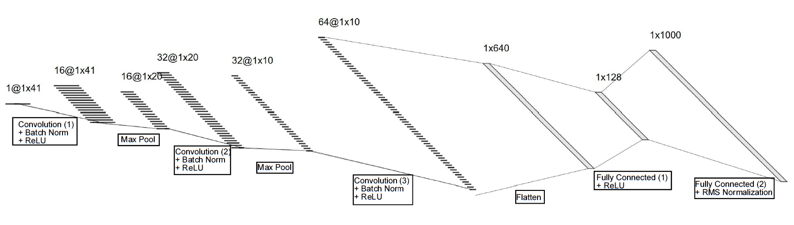

# Machine Learning for Black Phosphorus Spectrometer
Training repository for CNN used for spectrometer inference for [wavelength-scale black phosphorus spectrometer](https://www.nature.com/articles/s41566-021-00787-x). Includes training and evaluation scripts, as well as scripts for computing inference from Tikhonov and Lasso regularized regression models in original paper. Can be used for any spectrometer which measures a vector of datapoints (for example photocurrent at N different displacements) as a method of inference.

## Theory

The wavelength-scale black phosphorus spectrometer operates by measuring a series of photocurrents $I(D_i)$ at different applied electric displacements $D_i$. The intrinsic responsivity of the device $R(D_i, \lambda)$ varies strongly with $D$ due to the Stark effect — bias-dependent tuning of the bandgap — allowing different wavelengths to be encoded in the photocurrent response.  

The measured photocurrent is modeled as:

$$
I(D_i) = \int_{\lambda_{\text{low}}}^{\lambda_{\text{high}}} R(D_i, \lambda) \, P(\lambda) \, d\lambda
$$

where:
- $P(\lambda)$ is the unknown incident spectrum  
- $R(D_i, \lambda)$ is the responsivity at displacement $D_i$  
- $I(D_i)$ is the measured photocurrent  

To make this problem numerically tractable, the wavelength range is discretized and $P(\lambda)$ is approximated as a sum of Gaussian basis functions. This yields a matrix equation:

$$
R \cdot P = I
$$

Here:
- $R$ is the responsivity matrix  
- $P$ is the discretized spectrum vector  
- $I$ is the photocurrent vector  

Since $R$ is highly ill-conditioned (its rows are nearly colinear), naïve inversion amplifies noise. The original work by Yuan et al. used **Tikhonov** and **Lasso** regularized regression to recover $P$. These methods can approximate arbitrary spectra but suffer from:
- **Discretization error** (especially at low resolution)  
- **$\mathcal{O}(n^3)$ runtime**, making high-resolution real-time inference impractical  
- Possible **negative outputs**, which have no physical meaning for spectra  

### CNN-Based Inference
Instead of solving the ill-conditioned inverse problem directly, we use a **1D convolutional neural network (CNN)** trained end-to-end to map $I$ directly to $P$. 

Advantages:
1. Learns **nonlinear mappings** between photocurrent features and spectral features  
2. Enforces **spectral priors** like non-negativity and realistic shape  
3. Has **sub-$n^2$ complexity** for $n=1000$, enabling **real-time inference**  
4. Is a **feed-forward** model, unlike iterative regression methods  

The trained CNN is then deployed on an FPGA for hardware-accelerated inference, making on-chip, real-time spectrum reconstruction feasible.


## Network Architecture



## Installation
1. Clone the repo
```bash
git clone git@github.com:lwylonis/spectrometer_ml.git 
cd spectrometer_ml
```
2. Create a virtual-env and activate
```bash
python3 -m venv .venv
source .venv/bin/activate
```
3. Install dependencies
```
pip install -r requirements.txt
```
4. Install Jupyter (if you plan to run notebooks)
```
pip install jupyterlab
```

## Usage

1. **Process responsivity data**
```bash
bash scripts/csv_to_npy.sh \
    data/responsivity_data/raw/PhotoResponseSheet1.csv \
    data/responsivity_data/processed/displacements.npy \
    data/responsivity_data/processed/wavelengths.npy \
    data/responsivity_data/processed/responsivity.npy
```
Outputs .npy array for responsivity matrix, as well as wavelength and displacement values.

2. **Generate spectra**
```bash
bash scripts/generate_spectra.sh
```
NOTE: edit generate_spectra.sh to contain choice of dataset, seed, sample size, etc.
Will either generate random spectra + outputs as .npy files, or pull data from
specified dataset.

3. **Determine experimental parameters**
```bash
bash scripts/estimate_noise.sh
bash scripts/alpha_cross_val.sh
```
The first script will determine a phyiscal estimate for the standard deviation of the noise to use in the photocurrent measurement simulation.
The second script will determine the alpha values to use for Tikhonov and Lasso regularized regression for each resolution to be compared. You may addtionally enable plotting regression outputs with --plot

4. **Train model**
```bash
bash scripts/train.sh
tensorboard --logdir experiments
```
Again, you may change the hyperparameters in the shell script. This will also
launch tensorboard session to view model output throughout training.

5. **Evaluate model**
```bash
bash scripts/evaluate.sh
```
NOTE: You MUST keep same parameters for seed and validation size as training, otherwise
the validation split will be different from training.

6. **Compare model to Lasso and Tikhonov regularized regression**
```bash
bash scripts/compare_experiment
```
For this, also keep same parameters for seed and validation size as training! Additionally,
make sure to change alpha parameter to optimize Lasso/Tikhonov for your dataset. This will
print a summary of the mean squared error of the different models vs input over validation
dataset, as well as plotting images of the predicted spectra vs. ground truth.

7. **Save sample in/out to binary file (OPTIONAL)**
```bash
bash scripts/infer_to_bin.sh
```
This is used for creating a binary file of a trained model input and output for a given spectrum for hardware validation. To see the FPGA implementation of this model look [here](https://github.com/lwylonis/spectrometer_cnn).

## Customization

### Adding custom randomly simulated spectra method:

1. **Open `scripts/generate_spectra.py`**
2. **Add your method name to `VALID_METHODS = {"rand_sop", "uniform", "<your_method>"}`**
3. **Add your method to `generate_S`**
```python
    def generate_S(rng: np.random.Generator, n_samples: int, s_dim : int, method : str):
        if method == "uniform":
            return rng.uniform(size=(n_samples, s_dim)).astype(np.float32)
        elif method == "rand_sop":
            return sum_of_peaks(rng, n_samples, s_dim)
        elif method == "<your_method>:
            return <your_function>(rng, n_samples, s_dim)
```
4. **Implement your function under `Custom Generation Functions` section**
5. **Create a dataset in `src/datasets/datasets.py` under `SIMULATED DATASETS`**
```python
@register_dataset("<your_method>")
class SumOfPeaksDataset(NPYCachedDataset):
    def __init__(self, root, seed=42, transform=None):
        super().__init__(root, name="<your_method>", seed=seed, transform=transform)
```

Now you can run `python3 scripts/generate_random_spectra.py --method <your_method>` and
then train the model on this dataset!

### Adding custom dataset:

1. **Follow steps 1-3 for adding randomly simulated spectra method**
2. **Implement your function under `Custom Data Sampling Functions` section**
3. **Add your method to list of real functions (path is generated w/o random seed)**
```python
if method in {"custom1", }: # Add every real dataset here
    np.save(out_dir / f"S.npy", S)
    np.save(out_dir / f"I.npy", I)
```

Similarly to above, simply run same script to produce training data.

### Adding custom deep learning network architecture:

1. **Implent your class in `model.py` under `Model Classes` section**
2. **Follow below structure**
```python
@register_model("<model_name>")
class <YourModel>(nn.Module):
    def __init__(self, input_dim, output_dim):
        super().__init__()
        # TODO: Instantiate layers
    def __init__(self, x: torch.Tensor) -> torch.Tensor:
        # TODO: return model(x)
        return x
```

Now you can pass in `<model_name>` as your model parameter in your training script
to train your custom architecture.
